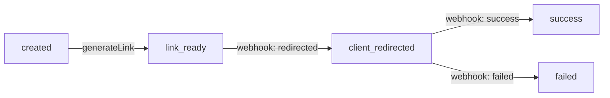

# 💳 Payment Service

Микросервис для управления жизненным циклом платежей с использованием **Event Sourcing**.

## 🎯 О проекте

Сервис отслеживает полный жизненный цикл платежа через события — от создания до завершения. Каждое изменение состояния сохраняется как событие, что позволяет восстановить полную историю платежа в любой момент времени.

### Основные возможности

- ✅ Создание платежей с валидацией
- ✅ Генерация уникальных ссылок для оплаты
- ✅ Обработка webhook от платёжных провайдеров
- ✅ Полная история событий платежа (Event Sourcing)
- ✅ REST API с автоматической документацией (Swagger)
- ✅ Типобезопасная обработка ошибок (Result type)

## 🏗️ Архитектура

Проект следует принципам **Clean Architecture** с явным разделением на слои:

```
src/
├── domain/           # Доменная логика (Payment агрегат, бизнес-правила)
├── application/      # Use cases (бизнес-сценарии)
├── infrastructure/   # Хранилище событий (InMemoryEventStore)
├── interfaces/       # HTTP API (контроллеры, схемы валидации)
└── shared/           # Общие утилиты (Result type, helpers)
```

### Event Sourcing

Вместо хранения текущего состояния, сервис сохраняет **последовательность событий**:

```
payment_initiated → payment_link_generated → client_redirected_to_provider → payment_succeeded
```

Состояние платежа восстанавливается из событий через метод `reconstitute()`.

## 🚀 Быстрый старт

### Требования

- **Node.js** 20+
- **pnpm** 8+
- **Docker** (опционально)

### 🐳 Запуск с Docker (рекомендуется)

1. **Создайте `.env` файл:**

```bash
APP_PORT=3000
PAYMENT_LINK_DOMAIN=https://pay.example.com
```

2. **Запустите контейнер:**

```bash
docker-compose up -d
```

3. **Откройте Swagger UI:**

```
http://localhost:3000/swagger
```

4. **Остановка:**

```bash
docker-compose down
```

### 💻 Запуск без Docker

1. **Установите зависимости:**

```bash
pnpm install
```

2. **Создайте `.env` файл:**

```bash
APP_PORT=3000
PAYMENT_LINK_DOMAIN=https://pay.example.com
```

3. **Запустите сервер:**

```bash
pnpm dev
```

4. **Swagger UI:**

```
http://localhost:3000/swagger
```

## 📡 API Endpoints

### Платежи

#### `POST /payments`
Создать новый платёж

**Request:**
```json
{
  "amount": 1000.50,
  "currency": "RUB",
  "description": "Оплата заказа #12345"
}
```

**Response:**
```json
{
  "paymentId": "550e8400-e29b-41d4-a716-446655440000"
}
```

---

#### `POST /payments/:id/link`
Сгенерировать ссылку для оплаты

**Response:**
```json
{
  "link": "https://pay.example.com/550e8400-e29b-41d4-a716-446655440000"
}
```

---

#### `GET /payments/:id/history`
Получить полную историю событий платежа

**Response:**
```json
{
  "paymentId": "550e8400-e29b-41d4-a716-446655440000",
  "status": "success",
  "history": [
    {
      "type": "payment_initiated",
      "timestamp": "2024-01-01T12:00:00.000Z",
      "payload": { "amount": 1000.50, "currency": "RUB" }
    },
    {
      "type": "payment_link_generated",
      "timestamp": "2024-01-01T12:00:01.000Z",
      "payload": { "link": "https://pay.example.com/..." }
    }
  ]
}
```

### Webhooks

#### `POST /webhook`
Обработать уведомление от платёжного провайдера

**Request:**
```json
{
  "paymentId": "550e8400-e29b-41d4-a716-446655440000",
  "status": "success"
}
```

Возможные статусы: `success`, `failed`, `redirected`

## 🎬 Жизненный цикл платежа



1. **Создание** (`POST /payments`) → статус `created`
2. **Генерация ссылки** (`POST /payments/:id/link`) → статус `link_ready`
3. **Клиент переходит** (`POST /webhook` с `redirected`) → статус `client_redirected`
4. **Завершение** (`POST /webhook` с `success`/`failed`) → статус `success`/`failed`

## 🧪 Тесты

Запуск тестов:

```bash
pnpm test
```

Покрытие:
- ✅ Доменная логика (валидация, переходы статусов)
- ✅ Бизнес-сценарии (полный жизненный цикл)
- ✅ Event Sourcing (восстановление из событий)

**16 тестов** используют встроенный Node.js test runner — без лишних зависимостей.

## 🛠️ Технологии

- **Node.js 20** + TypeScript
- **Elysia** — современный веб-фреймворк
- **Swagger** — автоматическая документация API
- **TypeBox** — валидация схем
- **Event Sourcing** — хранение истории событий
- **Result type** — явная обработка ошибок без exceptions

## 🏛️ Принципы дизайна

- **Clean Architecture** — независимость слоёв
- **Event Sourcing** — хранение истории вместо состояния
- **Domain-Driven Design** — богатая доменная модель
- **SOLID** — единая ответственность, инверсия зависимостей
- **Явная обработка ошибок** — Result type вместо try/catch
- **Типобезопасность** — полная поддержка TypeScript

## 📦 Структура событий

Каждое событие содержит:

```typescript
{
  aggregateId: string;      // ID платежа
  type: EventType;          // Тип события
  timestamp: Date;          // Время события
  payload: Record<string, unknown>;  // Данные события
}
```

### Типы событий:

| Событие | Описание |
|---------|----------|
| `payment_initiated` | Платёж создан |
| `payment_link_generated` | Ссылка для оплаты сгенерирована |
| `client_redirected_to_provider` | Клиент перешёл к провайдеру |
| `payment_succeeded` | Успешная оплата |
| `payment_failed` | Ошибка оплаты |
| `payment_expired` | Платёж истёк |


## 🚀 Масштабирование

Текущая реализация использует **in-memory** хранилище. Для production возможно:

1. **EventStore** → PostgreSQL / EventStoreDB
2. **Горизонтальное масштабирование** → несколько инстансов за балансировщиком
3. **Message Bus** → Kafka / NATS для событий между сервисами
4. **Read Models** → отдельные проекции для быстрого чтения

Благодаря Event Sourcing и чистой архитектуре, замена InMemoryEventStore на реальную БД потребует изменений только в infrastructure-слое.

## 📝 Переменные окружения

| Переменная | Описание | Пример |
|------------|----------|--------|
| `APP_PORT` | Порт приложения | `3000` |
| `PAYMENT_LINK_DOMAIN` | Домен для ссылок оплаты | `https://pay.example.com` |

## 🤝 Разработка

Структура проекта следует принципам модульности:

```
payment-service/
├── src/
│   ├── domain/              # Чистая бизнес-логика
│   ├── application/         # Оркестрация use cases
│   ├── infrastructure/      # Внешние зависимости
│   ├── interfaces/          # HTTP API
│   └── shared/              # Утилиты
├── tests/
│   ├── domain/              # Тесты доменной логики
│   └── application/         # Тесты бизнес-сценариев
├── configs/                 # Конфигурация
├── Dockerfile               # Multi-stage build
└── docker-compose.yml       # Оркестрация
```
